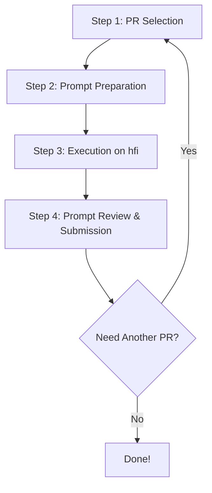

Sharing them below 👇
Additional Resources:
1️⃣ Written Guide – Step-by-step document to help you navigate the work
https://docs.google.com/document/d/1vuX9rZlFTzt3cRj3CgdNmR9_oqVsPVfaq4g6Obfve0w/edit?usp=sharing
2️⃣ How to Write a Good Prompt (Video)
https://www.loom.com/share/b092a744ec644f369b947101e806babf
3️⃣ Getting Familiar with Any Repo (Video)
https://www.loom.com/share/2d5475a8ef254daba8c83fc22e629021
4️⃣ How to Inspect Generated Files (Video)
https://www.loom.com/share/63a52cc87ca1416799ceb1b29f238759
5️⃣ Feedback Walkthrough (Video)
https://www.loom.com/share/b462c2f19f39449481584828461dfae7

⚠️ Important Note:
These videos were recorded during Project V1, when we were using Anthropic Cloud.
For Marlin, we now use the Anthropic CLI, so please don’t get confused by tooling differences.

The goal of these resources is to give you a conceptual understanding of:
How to think about tasks
How to approach prompts
How to review outputs

👉 Always follow the official flow and instructions mentioned on the Marlin training website for actual task execution.


# 🚀 Project Marlin - Complete Beginner's Guide


> **Welcome to Project Marlin!** This guide will walk you through everything you need to know to successfully contribute to this project, from setup to submission.

---

## 📋 Table of Contents

1. [What is Project Marlin?](#what-is-project-marlin)
2. [Prerequisites & Setup](#prerequisites--setup)
3. [The 4-Step Workflow](#the-4-step-workflow)
4. [Detailed Step-by-Step Instructions](#detailed-step-by-step-instructions)
5. [Snorkel Questions Guide](#snorkel-questions-guide)
6. [Best Practices & Tips](#best-practices--tips)
7. [Common Issues & Troubleshooting](#common-issues--troubleshooting)
8. [Important Rules & Warnings](#important-rules--warnings)

---

## 🎯 What is Project Marlin?

**Project Marlin** is a task where you prompt an AI model to generate **production-ready Pull Requests (PRs)** for open-source Python repositories. Your goal is to:

1. Select a complex PR from a repository
2. Prepare a detailed strategy and prompt
3. Guide an AI model through multiple turns to implement the PR
4. Ensure the final code is production-ready and mergeable

**Key Points:**
- ✅ You work with **two AI trajectories** (A and B) simultaneously
- ✅ Each task requires **at least 3 turns** to be complete
- ✅ You must **test and verify** all code changes
- ✅ Final submission must be **production-ready** (ready to merge)

---

## 🛠️ Prerequisites & Setup

### **System Requirements**

Before starting, ensure you have:

| Requirement | Description |
|-------------|-------------|
| **Operating System** | WSL (Windows Subsystem for Linux), macOS, or Linux |
| **Git** | Version control system |
| **VS Code** | Code editor (added to PATH) |
| **Python** | For running tests |
| **tmux** | Terminal multiplexer |
| **Internet** | Stable connection |

### **Initial Setup (WSL Users)**

> **Note**: If you're using WSL, adjust paths according to your system. Use ChatGPT for minor issues.

#### **Step 1: Install Required Tools**

```bash
# Install tmux (required for viewing AI model output)
sudo apt update
sudo apt install tmux

# Verify installation
tmux -V
```

#### **Step 2: Add VS Code to PATH**

**From inside VS Code:**
1. Press `Ctrl + Shift + P` (Windows/Linux) or `Cmd + Shift + P` (macOS)
2. Type: `Shell Command: Install 'code' command in PATH`
3. Press Enter

**Verify:**
```bash
code --version
```

---

## 🔄 The 4-Step Workflow

Project Marlin follows a structured workflow:




## 📖 Detailed Step-by-Step Instructions

### **STEP 1: PR Selection** 🎯


#### **What to Do:**

1. **Login** to Snorkel Expert Platform
2. Find the **"Marlin-PR-Selection"** task on the homepage
3. Click **"Start"** to launch the task

#### **Selecting a Good PR:**

**✅ Choose a PR that:**
- Is **sufficiently complex** (would take a human engineer 2+ hours)
- Primarily involves **Python code changes**
- Would require a model to struggle for 2-3 tries
- Is like a **Jira ticket for a mid-level engineer**

**❌ Avoid PRs that:**
- Are too simple (model could complete in 1 turn)
- Don't involve Python code
- Only update documentation or config files

#### **How to Select:**

1. **Left Side**: Browse the PR Glossary (repositories and PRs)
2. **Right Side**: Select your repository and corresponding PR
3. **Review on GitHub**: Copy the PR URL and review it in your browser
4. **Submit**: Select repository under "Multi-dimensional radio" and PR under "Sub-topic required"
5. **Wait**: 1-2 minutes for processing


---

### **STEP 2: Prompt Preparation** 📝


#### **What to Do:**

1. Find the **"Marlin-Prompt-Preparation"** task on the homepage
2. Click **"Start"** to launch the task
3. Answer all required questions 

#### **⏰ Timing Warning:**

> **ONLY** select Prompt Preparation if you plan to work on it **within 4 hours**, or it might expire! MIGHTTTT not suree

#### **Before You Start:**

**✅ CRITICAL**: You **MUST** set up the repository, install dependencies, and run existing tests **BEFORE** submitting Prompt Preparation!

**Setup Steps:**

```bash
# 1. Create directory for your work
mkdir -p ~/marlin/[repo-name]/[pr-number]
cd ~/marlin/[repo-name]/[pr-number]

# 2. Download the tarball (you'll receive this link after PR selection)
# Copy from Windows to WSL (adjust path as needed)
cp /mnt/c/Users/TIWAR/Downloads/[repo-tarball].tar.gz .

# 3. Extract the tarball
tar -xzf [repo-tarball].tar.gz

# 4. Navigate into the extracted directory
cd [extracted-directory-name]

# 5. Initialize git repository
git init
git add .
git commit -m "before first prompt"


```

#### **Answer All Questions:**

See the [Snorkel Questions Guide](#snorkel-questions-guide) section below for detailed guidance on each question.

#### **Quality Checks:**

Before submitting:
- ✅ Click **"Check feedback"** to get automated feedback
- ✅ Ensure **Most** checks show "Passed" (few failing like grammar and structure is acceptable try to pass most)
- ✅ Read the **full evaluation message**, not just the headline
- ✅ Address any issues before submitting

#### **Wait for Approval:**

- Reviews typically happen **during the night** 
- You'll receive an **email notification** when approved
- Check your email in the morning

---

### **STEP 3: Execution on Anthropic Platform** 🤖

**Platform**: [Anthropic Feedback Platform](https://feedback.anthropic.com/claude_code?email_login=true)

#### **After Approval:**

Once your Prompt Preparation is **ACCEPTED**, you'll receive an email with:
- ✅ Repository and PR details
- ✅ **Alias email** for logging into Anthropic's tool
- ✅ Link to download the repository tarball

#### **Setup Process:**

##### **1. Download and Extract Repository**

```bash
# Navigate to your working directory
cd ~/marlin/[repo-name]/[pr-number]

# Download tarball from the email link
# Copy from Windows to WSL
cp /mnt/c/Users/TIWAR/Downloads/[repo-tarball].tar.gz .

# Extract
tar -xzf [repo-tarball].tar.gz

# Navigate into directory
cd [extracted-directory]

# Initialize git
git init
git add .
git commit -m "before first prompt"
```

##### **2. Login to Anthropic Platform**

1. Go to: https://feedback.anthropic.com/claude_code?email_login=true
2. **Login using your alias email** (not the alias)
3. Enter the verification code sent to your **original email**

##### **3. Download claude-hfi Tool**

1. On the Anthropic platform, download the appropriate CLI tool:
   - **macOS (Intel)**: `darwin-amd64`
   - **macOS (ARM)**: `darwin-arm64`
   - **Linux AND WSL **: `linux-x64`

2. The file downloads to `~/Downloads` by default

##### **4. Prepare claude-hfi Tool**

```bash
# Navigate to repository root
cd ~/marlin/[repo-name]/[pr-number]/[extracted-directory]

# Copy claude-hfi from Downloads (adjust path for WSL)
cp /mnt/c/Users/TIWAR/Downloads/[downloaded-filename] ./claude-hfi

# Make it executable
chmod +x claude-hfi

# Verify
ls -la claude-hfi
```

**⚠️ Important**: Each repository needs its own copy of `claude-hfi` at the root!

##### **5. Launch claude-hfi**

```bash
# Launch in VS Code mode
./claude-hfi --vscode
```

**Output:**
```
Trajectory A:
  Worktree: ~/.cache/claude-hfi/.../A
  Terminal: tmux attach -t <session-id>-A

Trajectory B:
  Worktree: ~/.cache/claude-hfi/.../B
  Terminal: tmux attach -t <session-id>-B

HFI - Human Feedback Interface

Please enter the interface code:
```

**💡 Tip**: Run this command from a terminal **outside** VS Code (e.g., macOS Terminal, iTerm, or WSL terminal) for best results.

##### **6. Enter Interface Code**

When prompted, enter:
```
cc_agentic_coding
```

This will open **two VS Code windows** (Trajectory A and Trajectory B).

##### **7. Attach to tmux Sessions**

In **each** VS Code window, open the integrated terminal and attach to the corresponding tmux session:

**Trajectory A window:**
```bash
tmux attach -t <session-id>-A
```

**Trajectory B window:**
```bash
tmux attach -t <session-id>-B
```


##### **8. Provide Your Initial Prompt**

In the **main terminal** (where you ran `./claude-hfi --vscode`):
1. Paste the **full prompt** you prepared in Prompt Preparation
2. Press **Enter** to begin execution

**Example:**
```
> Implement the backup directory feature for Picard's maintenance options...

Waiting for trajectories to complete.
Check tmux sessions for possible tool permission requests.
```

##### **9. Wait for Completion**

- ⏳ Can take **5-10 mins** for the model to respond
- 👀 Monitor both tmux sessions for:
  - Command execution
  - File generation
  - Test results

**Do not proceed** until both trajectories show completion!

##### **10. Review Generated Files**

**🚨 CRITICAL**: You **MUST** thoroughly review **ALL** file changes!

**How to Review:**

1. **Open VS Code Source Control panel** in each trajectory window
2. **Click on every modified file**
3. **Examine line-by-line diffs**
4. **Verify**:
   - ✅ All requested changes are implemented
   - ✅ No unnecessary changes or files
   - ✅ No missing functionality
   - ✅ Code quality is good
   - ✅ Tests pass

**Using Git Diff:**

```bash
# In Trajectory A window
git diff

# In Trajectory B window
git diff
```


**✅ Verify**: All tests pass!

##### **12. Compare Trajectories**

After both complete, compare the outputs:

**Trajectory A:**
```bash
cd ~/.cache/claude-hfi/.../A
git diff
```

**Trajectory B:**
```bash
cd ~/.cache/claude-hfi/.../B
git diff
```

**Choose the better trajectory** based on:
- ✅ Correctness
- ✅ Code quality
- ✅ Completeness
- ✅ Test coverage

##### **13. Submit Feedback**

In the main terminal, you'll be prompted to:
1. **Select the winning trajectory** (A or B)
2. **Provide justification** (in your own words, no AI!)
3. **Answer questions** about pros/cons of each trajectory
4. **Press Enter** to submit

##### **14. Multi-Turn Process**

**⚠️ IMPORTANT**: Each task requires **at least 3 turns**!

**After Turn 1:**
BOTH trajectory will be synced with The one you selected as winner in 1 

4. **Provide Turn 2 prompt** addressing issues from Turn 1
5. **Repeat** until the code is production-ready

**Turn 2+ Prompts Should:**
- ✅ Fix errors from previous turn
- ✅ Address missed requirements
- ✅ Add missing tests
- ✅ Improve code quality
- ✅ Handle edge cases

**Example Turn 2 Prompt:**
```
You missed these files:
- src/module/file.py

Also, the tests are failing:
- test_feature_x is failing because...

Please fix these issues and ensure all tests pass.
```

##### **15. Final Submission**

When the code is **production-ready**:
- ✅ All tests pass
- ✅ All requirements met
- ✅ No errors or warnings
- ✅ Code is clean and well-documented
- ✅ At least 3 turns completed
Ctrl + C on terminal exit and wait few mins before going on snorkel platform and viewing the result there

---

### **STEP 4: Prompt Review & Submission** 📤


3. Answer all questions about your submission


#### **Wait for Review:**

- ⏳ Wait **4-5 minutes** after CLI submission
- ✅ Verify submission in Prompt Review
- ✅ Check that it has at least 3 turns
- ✅ Check that all questions are answered

#### **Check Dashboard:**

- Rejected tasks will appear with **reason for rejection**
- Learn from feedback and improve next time!

---

## 📋 Snorkel Questions Guide

When filling out the **Marlin-Prompt-Preparation** task, you'll answer several questions. Here's how to approach each one:

### **Section 1: Context Setting**

#### **Question 1: Repo Definition**
**"Please outline your understanding of the repo's functionality"**

**What to Include:**
- What the repository does (its purpose)
- Key features and components
- Technology stack (Python version, frameworks, etc.)
- Target users or use cases

**Example:** This is ai generated You have to create your own
```


Picard is a cross-platform music tagger written in Python. It allows users to:
- Automatically identify and tag music files using MusicBrainz database
- Organize music collections with accurate metadata
- Support for various audio formats (MP3, FLAC, etc.)
- Plugin system for extensibility

```

**✅ Use your own words** - No AI/LLM!

---

#### **Question 2: PR Definition**
**"Please outline your understanding of this PR and its impact on the repo"**

**What to Include:**
- What the PR aims to accomplish
- Why this change is needed
- What files/components will be affected
- Impact on existing functionality

**Example:** This is ai generated You have to create your own
```
This PR adds a configurable backup directory feature to Picard's maintenance options.

Current behavior: Backups are saved to a hardcoded Documents folder.

Proposed change: Users can select a custom backup directory via UI.

Impact:
- Adds new UI widgets (label, text field, browse button)
- Stores setting in config file
- Validates directory (exists, writable)
- Updates backup save/load operations to use configured directory

Files affected:
- picard/ui/options/maintenance.py (main logic)
- ui/options_maintenance.ui (UI definition)
- picard/profile.py (settings persistence)
```

**✅ Use your own words** - No AI/LLM!

---


#### **Question 3: Edge Cases**
**"Are there any edge cases that the model needs to consider?"**

**What to Include:**
- Unusual inputs or scenarios
- Boundary conditions
- Error conditions
- Platform-specific issues

**Example:**
```
Edge cases to consider:
1. Empty directory path input
2. Non-existent directory path
3. Directory exists but is not writable
4. Network paths (\\server\share on Windows)
5. Very long path names (>260 chars on Windows)
6. Special characters in path (spaces, unicode)
7. Directory gets deleted while app is running
8. Permissions change after initial validation
```


---

#### **Question 4: Acceptance Criteria** 
**"What are the acceptance criteria for production-ready code? What will you test?"**

**What to Include:**
- Measurable criteria
- Specific test scenarios
- Expected behaviors
- Quality standards

**Example:**
```
Acceptance Criteria:
1. UI Integration:
   - Backup directory widgets appear in maintenance options
   - Browse button opens file picker dialog
   - Selected path displays in text field

2. Validation:
   - Empty path shows error message
   - Non-existent directory shows error
   - Non-writable directory shows error
   - Valid directory is accepted

3. Functionality:
   - Save backup uses configured directory
   - Load backup uses configured directory
   - Setting persists across app restarts
   - Setting persists across profile switches

4. Testing:
   - All existing tests still pass
   - New tests for validation logic
   - New tests for UI integration
   - Edge cases are handled


```

**✅ Must be measurable!**

---

#### **Question 5: Testing Setup**
**"Have you set up the repo, installed dependencies, and run existing tests?"**

**Options:**
- ✅ **Yes** (required to proceed!)
- ❌ **No** (you must set it up first!)

**⚠️ CRITICAL**: You **MUST** answer "Yes" and have actually completed the setup!

---

### **Section 3: Prompt Definition**

#### **Question 6: Initial Prompt**
**"Draft the first prompt you will provide to the AI model"**

**What to Include:**
- Clear description of the task
- Specific requirements
- Files to modify
- Expected output format
- Any constraints

**Example:**
```
Implement a configurable backup directory feature for Picard's maintenance options.

Requirements:
1. Add UI widgets to maintenance options page:
   - Label: "Backup Directory:"
   - Text field for directory path
   - Browse button to select directory

2. Store the selected directory in config as 'autobackup_directory'

3. Default to user's Documents folder

4. Validate directory:
   - Check if path is empty
   - Check if directory exists
   - Check if directory is writable
   - Show error dialog for invalid paths

5. Use the configured directory for:
   - Saving backup files
   - Loading backup files

6. Update these files:
   - picard/ui/options/maintenance.py
   - ui/options_maintenance.ui
   - picard/ui/ui_options_maintenance.py (auto-generated)
   - picard/profile.py (add setting to profile system)

7. Add unit tests for validation logic

8. Ensure all existing tests still pass

```

**❌ NO "Role-Based Prompting"!**
- Don't start with "As a software engineer..."
- Don't use "You are an expert..."
- Just describe the task directly

**✅ Use your own words** - No AI/LLM!

---

## 💡 Best Practices & Tips

### **General Tips:**

1. **✅ Start Small**: Choose PRs you understand well for your first few submissions
2. **✅ Read the Original PR**: Study the actual PR on GitHub before starting
3. **✅ Test Everything**: Run all tests after each turn
4. **✅ Document Your Work**: Keep notes on what you're doing

### **PR Selection Tips:**

1. **✅ Look for Python-heavy PRs**: Must primarily involve Python code
2. **✅ Check the diff**: Review what files are changed in the original PR
3. **✅ Estimate complexity**: Would a human take 2+ hours?
4. **✅ Avoid simple PRs**: Model should struggle for 2-3 tries

### **Prompt Writing Tips:**

1. **✅ Be Specific**: List exact files to modify
2. **✅ Include Constraints**: Mention what NOT to change
4. **✅ Mention Tests**: Explicitly request test updates
5. **✅ Use Your Own Words**: No AI/LLM assistance!

### **Review Tips:**

1. **✅ Check Every File**: Don't skip any modified files
2. **✅ Run Tests**: Verify all tests pass
3. **✅ Compare Trajectories**: Analyze both A and B carefully
4. **✅ Look for Errors**: Check for missing imports, typos, etc.
5. **✅ Verify Completeness**: Ensure all requirements are met

### **Multi-Turn Tips:**

1. **✅ Be Specific About Errors**: Quote exact error messages
2. **✅ Point to Files**: Mention specific files and line numbers

---


---

### **Issue 2: Lost Main Terminal Session**

**Problem**: Main terminal session is lost, but VS Code windows and tmux sessions are still running.

**Solution**:
```bash
# Resume from the repository root
./claude-hfi --continue --vscode
```

**⚠️ Important**: Must use both `--continue` and `--vscode` flags together!

---


---

---

## ⚠️ Important Rules & Warnings

### **🚨 CRITICAL RULES:**

#### **1. NO AI/LLM Usage!**

**❌ STRICTLY PROHIBITED:**
- Using ChatGPT, Claude, or any LLM for prompts
- Using AI to answer Snorkel questions
- Copying prompts from AI tools
- Plagiarizing from other sources

**✅ REQUIRED:**
- Use your own words
- Use your own expertise
- Use your own ideas

**⚠️ Violation = Rejection + Possible Dismissal!**

---

#### **2. Minimum 3 Turns Required!**

**❌ DON'T:**
- Submit after 1 or 2 turns
- Choose PRs that are too simple

**✅ DO:**
- Ensure at least 3 turns
- Choose complex PRs
- Guide the model through iterations

**Why?** If the model completes the PR in 1 turn, the task was too simple!

---


**✅ DO:**

- Verify all functionality works

---

#### **4. Python Code Required!**

**❌ DON'T:**
- Select PRs with no Python changes
- Select documentation-only PRs
- Select config-only PRs

**✅ DO:**
- Choose PRs with significant Python code changes
- Check the diff on GitHub
- Verify Python files are modified

---

#### **5. Use Correct PR Link!**

**❌ WRONG:**
```
https://github.com/user/repo/tree/branch-name
```

**✅ CORRECT:**
```
https://github.com/user/repo/pull/123
```

Must link to the **pull request**, not the repository or branch!

---

### **📌 Important Notes:**

1. **Reviews**: Happen during night (US time), check email in the morning , Speed is improving it can be after few hrs also check emails

---

**Remember**: Quality over quantity. Take your time, be thorough, and use your own expertise!
